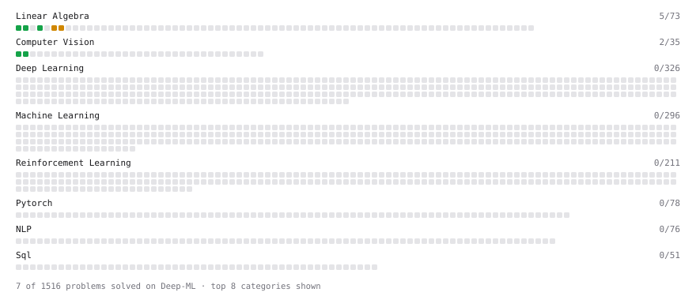

# Deep-ML

My machine learning practice from [Deep-ML](https://www.deep-ml.com). Every solution here was written by hand.

**34** solved · 31 problems · 1 labs · 2 math

[**Browse the interactive portfolio**](https://NabilaTasfihaRahman.github.io/deep-ml/) to replay this filling in over time.

## Problems

| | Difficulty | Solved | |
| --- | --- | --- | --- |
| [Calculate Image Brightness](https://www.deep-ml.com/problems/70) | easy | 2026-09-12 | [solution](problems/0070-calculate-image-brightness) |
| [Calculate Mean by Row or Column](https://www.deep-ml.com/problems/4) | easy | 2026-09-11 | [solution](problems/0004-calculate-mean-by-row-or-column) |
| [Create a Float Tensor from a Python List](https://www.deep-ml.com/problems/880) | easy | 2026-10-06 | [solution](problems/0880-create-a-float-tensor-from-a-python-list) |
| [Derivatives of Activation Functions](https://www.deep-ml.com/problems/217) | easy | 2026-09-15 | [solution](problems/0217-derivatives-of-activation-functions) |
| [Grayscale Image Contrast Calculator](https://www.deep-ml.com/problems/82) | easy | 2026-09-12 | [solution](problems/0082-grayscale-image-contrast-calculator) |
| [Implement a Simple Residual Block with Shortcut Connection](https://www.deep-ml.com/problems/113) | easy | 2026-10-05 | [solution](problems/0113-implement-a-simple-residual-block-with-shortcut-connection) |
| [Implement Global Average Pooling](https://www.deep-ml.com/problems/114) | easy | 2026-10-05 | [solution](problems/0114-implement-global-average-pooling) |
| [KL Divergence Between Two Normal Distributions](https://www.deep-ml.com/problems/56) | easy | 2026-09-29 | [solution](problems/0056-kl-divergence-between-two-normal-distributions) |
| [Linear Regression Using Normal Equation](https://www.deep-ml.com/problems/14) | easy | 2026-10-06 | [solution](problems/0014-linear-regression-using-normal-equation) |
| [Matrix-Vector Dot Product](https://www.deep-ml.com/problems/1) | easy | 2026-09-11 | [solution](problems/0001-matrix-vector-dot-product) |
| [Random Rotation Matrix and a Rotation Layer](https://www.deep-ml.com/problems/1190) | easy | 2026-10-05 | [solution](problems/1190-random-rotation-matrix-and-a-rotation-layer) |
| [Reshape and Transpose a Tensor](https://www.deep-ml.com/problems/881) | easy | 2026-10-06 | [solution](problems/0881-reshape-and-transpose-a-tensor) |
| [Thanksgiving Feast Predictor: Softmax for Dish Selection](https://www.deep-ml.com/problems/216) | easy | 2026-09-15 | [solution](problems/0216-thanksgiving-feast-predictor-softmax-for-dish-selection) |
| [Transpose of a Matrix](https://www.deep-ml.com/problems/2) | easy | 2026-09-11 | [solution](problems/0002-transpose-of-a-matrix) |
| [Calculate Eigenvalues of a Matrix](https://www.deep-ml.com/problems/6) | medium | 2026-09-11 | [solution](problems/0006-calculate-eigenvalues-of-a-matrix) |
| [Compute the Hessian Matrix](https://www.deep-ml.com/problems/218) | medium | 2026-09-15 | [solution](problems/0218-compute-the-hessian-matrix) |
| [Dropout Layer](https://www.deep-ml.com/problems/151) | medium | 2026-09-27 | [solution](problems/0151-dropout-layer) |
| [Filter, Group, and Aggregate a DataFrame (Top-10 by Metric)](https://www.deep-ml.com/problems/1127) | medium | 2026-10-06 | [solution](problems/1127-filter-group-and-aggregate-a-dataframe-top-10-by-metric) |
| [Implement Long Short-Term Memory (LSTM) Network](https://www.deep-ml.com/problems/59) | medium | 2026-10-01 | [solution](problems/0059-implement-long-short-term-memory-lstm-network) |
| [Implement Masked Self-Attention](https://www.deep-ml.com/problems/107) | medium | 2026-10-02 | [solution](problems/0107-implement-masked-self-attention) |
| [Implement Self-Attention Mechanism](https://www.deep-ml.com/problems/53) | medium | 2026-09-29 | [solution](problems/0053-implement-self-attention-mechanism) |
| [Implementing a Simple RNN](https://www.deep-ml.com/problems/54) | medium | 2026-09-29 | [solution](problems/0054-implementing-a-simple-rnn) |
| [LoRA: Low-Rank Adaptation Forward Pass](https://www.deep-ml.com/problems/222) | medium | 2026-09-15 | [solution](problems/0222-lora-low-rank-adaptation-forward-pass) |
| [Matrix Transformation ](https://www.deep-ml.com/problems/7) | medium | 2026-09-11 | [solution](problems/0007-matrix-transformation) |
| [QLoRA: Quantized Low-Rank Adaptation Forward Pass](https://www.deep-ml.com/problems/223) | medium | 2026-09-15 | [solution](problems/0223-qlora-quantized-low-rank-adaptation-forward-pass) |
| [SGD with Momentum Step](https://www.deep-ml.com/problems/1235) | medium | 2026-10-01 | [solution](problems/1235-sgd-with-momentum-step) |
| [Single Neuron with Backpropagation](https://www.deep-ml.com/problems/25) | medium | 2026-09-29 | [solution](problems/0025-single-neuron-with-backpropagation) |
| [The Pattern Weaver's Code](https://www.deep-ml.com/problems/89) | medium | 2026-10-01 | [solution](problems/0089-the-pattern-weaver-s-code) |
| [Implement Multi-Head Attention](https://www.deep-ml.com/problems/94) | hard | 2026-10-02 | [solution](problems/0094-implement-multi-head-attention) |
| [Positional Encoding Calculator](https://www.deep-ml.com/problems/85) | hard | 2026-10-01 | [solution](problems/0085-positional-encoding-calculator) |
| [Train a Simple GAN on 1D Gaussian Data](https://www.deep-ml.com/problems/174) | hard | 2026-09-15 | [solution](problems/0174-train-a-simple-gan-on-1d-gaussian-data) |

## Labs

| | Difficulty | Solved | |
| --- | --- | --- | --- |
| [Design Your Own Activation Function](https://www.deep-ml.com/labs/9) | easy | 2026-10-06 | [solution](labs/0009-design-your-own-activation-function) |

## Math

| | Difficulty | Solved | |
| --- | --- | --- | --- |
| [Derivatives and Gradients](https://www.deep-ml.com/math-problems/1) | easy | 2026-09-11 | [solution](math/0001-derivatives-and-gradients) |
| [Gradient Descent Updates](https://www.deep-ml.com/math-problems/5) | easy | 2026-09-11 | [solution](math/0005-gradient-descent-updates) |

---

_This file is regenerated by Deep-ML on every push._
